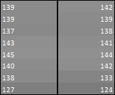

# The Discrete Cosine Transform 

I had to spend quite a time on learning, understandig the DCT, attemping to write own IDCT routines for my stand-alone JPEG and video decoders, like MPEG, H.263 and HEVC. 

## What is the DCT as compression? 

It's a mathematical *transform* of a series of values. The new values require less space to store and carry. After the inverse transform, the original values can *almost* be recovered. So it's a lossy compression. When it comes to images, the difference is almost invisible - but it's worth it! An image file is only 10% to the original, a video needs much less bandwith to broadcast, etc. 

Here is an example. Lets say we have the following 8 image sample values we'd like to encode and transfer. After performing the DCT the new series is a little special: the first value has big magnitude, while the others are quite small.. This compression method uses also quantization: simply divides all these values before encoding (here I just used Q=10, then rounded to nearest integer). 

So we got (39, 1, -1, 1) to encode and transfer. This can be quite efficient. 

On the decoder side, de-quantization multiplies all values by Q, then performs the inverse DCT:  

	SAMPLE          DCT        Q                |                  DQ      IDCT     DIFF
	                                            |
	139          391,74       39                |                 390       142       3
	139            5,27        1                |                  10       139       0
	137          -10,16       -1          39, 1, -1, 1            -10       138       1
	143            6,92        1       ---------|------->          10       141      -2
	145            0,00        0                |                   0       144      -1
	140            1,72        0                |                   0       142       2
	138           -4,21        0                |                   0       133      -5
	127            0,63        0                |                   0       124      -3

The reconstructed sample values are not so far from the original.. with only some small differences: 

**But:**  it's so computational intensive... that it almost kills the whole process. 

Since the Discrete Cosine Transform (DCT) was first introduced in 1974 by Ahmed et al. using real numbers, there are attempts for fast algorithms. My favourite is the LLM from 1989, where the 8-point DCT can be computed using only 11 multiplications. 

